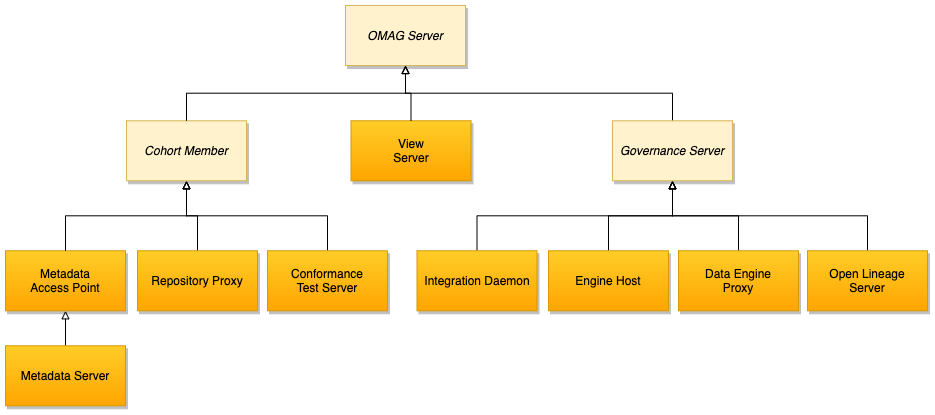

# Egeria

[Egeria](https://github.com/odpi/egeria/) is an open source project that provides open standards and implementation libraries to connect tools, catalogs and platforms together so they can share metadata and the technology that supports it.

It uses the open metadata and governance standards and ensures compliance to it.

The OMAG Server Platform provides a runtime process and platform for Open Metadata and Governance (OMAG) Services.
The OMAG services are configured and activated in OMAG Servers using the Administration Services. 
The configuration operations of the admin services create configuration documents, one for each OMAG Server. 
Inside a configuration document is the definition of which OMAG services to activate in the server. 
These include the repository services (any type of server), the access services (for metadata access points and metadata servers), 
governance services (for governance servers) and view services (for view servers). 

 


Once a configuration document is defined, the OMAG Server can be started and stopped multiple times by the admin services server instance operations.

The OMAG Server Platform can host multiple OMAG servers at any one time. Each OMAG server is isolated within the server platform and so the OMAG server platform can be used to support multi-tenant operation for a cloud service, or host a variety of different OMAG Servers needed at a particular location.


## Getting started


### OMAG only with docker

Start a single OMAG server platform. 
```sh
docker run --publish 19443:9443 odpi/egeria
```

Access to [https://localhost:19443/swagger-ui/index.htm](https://localhost:19443/swagger-ui/index.html)

### Example with docker compose

Once the main repo cloned, under `open-metadata-resources/open-metadata-deployment/compose/tutorials` starts

```sh
docker-compose -f ./egeria-tutorial.yaml up -d
```

Go to [http://localhost:18888](http://localhost:18888) to open the Jupyter interface and load a tutorial notebook.

or the simplest topology from this project under `studies/egeria`

```sh
docker-compose up -d

```


## Features

Egeria includes the following features:

* libraries that can be embedded into technologies that need to share metadata
* an integration platform called the *Open Metadata and Governance* (OMAG) Platform for hosting connectors, metadata servers and governance servers

Servers are part of a [cohort](https://egeria.odpi.org/open-metadata-implementation/admin-services/docs/concepts/cohort-member.html) which exchanges metadata using peer to peer replication protocol and federated queries.

There are three types of cohort member to consider:

* A **Metadata Server** that uses a native Egeria repository to store open metadata. There should be at least one of these servers in a cohort. It used to support either a community of users that are using the Egeria functions directly or to fill in any gaps in the metadata support provided by the third party tools that are connected to the cohort.
* A **Metadata Access Point** that has no metadata repository of its own and uses federated queries to retrieve and store metadata in the other repositories connected to the cohort.
* A **Repository Proxy** that connects in a thrid party metadata server.

 

Once a server has joined a cohort it can exchange metadata with the other members of that cohort.At the heart of each cohort is an event Kafka topic.

Governance server is a service to perform:

* discover and analyze content from metadata resources. The result of a discovery service's analysis is stored in a metadata server as a discovery analysis report that is chained off of the asset's definition.
* governance action services monitor the asset metadata and verify that it is set up correctly, they also determine how to fix anomalies, errors and ommisions, make the necessary changes and provision real-world artifacts and resources beased on the resulting metadata.

Users can add assets for governance and can contribute and comments. They can connect to any sever within the cohort to see the metadata.
Egeria has multiple levels of security so that access to individual metadata instances can be controlled

### Install on kubernetes

The minimum configuration is:

* Kafka 
* A metadata server with a persistent graph store
* a server for the UI

There is an [operator under construction](https://github.com/odpi/egeria-k8s-operator). 

Otherwise use the Helm install and use the charts from open-metadata-resources/open-metadata-deployment/charts/

## Define Assets

An [**Asset**](https://github.com/odpi/egeria/tree/master/open-metadata-implementation/access-services/docs/concepts/assets) represents a real resource of value that needs to be governed to ensure it is properly managed and used.

Assets are stored in **Catalog**. Governance zones are groups of related assets, and assets within a zone can be access controlled.

Types of assets:

* Infrastructure
* Process
* DataStore
* DataFeed
* Dataset
* Deployed API

**Schema** describes the data fileds and operations of the asset.  
**Connection** object define information to connect to an asset. It is used to create connector. 

Asset has ownership who is responsible for the asset. 
**Governance zones** allow assets to be grouped according to their usage. It is possible to assign supported zones to Egeria's open metadata access services (OMAS).

**Classifiers** add labels and properties to the asset, so they can be easily retrieved: it canbe glossary of terms, reference value, informal tag.

Assets and classifiers are referenceable, they have a unique qualified name.

### Cloud information model

[Cloud Information Model (otherwise known as CIM) ](https://cloudinformationmodel.org/) is an open specification to help integrate data across different cloud and on-premise applications.
The CIM provides a common language to describe the different types of data. This is extremely valuable to the open metadata and governance ecosystem with its focus on building an open and transparent view of data across an organization.

Standard models are released in many different formats, some following open standards and others using a proprietary standard, 
often defined by a particular modeling tool. Egeria typically provides a parser to read the specific model format and then a builder to convert the content into an open metadata archive and then a writer to write out the contents to a file for distribution

## Asset lineage

Track the origin of the data that is held by the asset. There are different perspectives on what is meant the "origin". 

Lineage helps to decide what asset to use for a particular task. It is also used to build reports for regulators. 

##  Open Discovery Framework (ODF)

Open Discovery Framework (ODF) defines open interfaces for components that implement specific types of metadata discovery. 
These components can then be called from tools offered by different vendors through the open APIs.
**Discovery service** can access the existing metadata about an asset, and store additional information about the asset that it discovers.

Discovery services are specialist governance services. They are grouped together into a useful collection of capability called a governance engine.
The same discovery service may be used in multiple governance engines.

Egeria provides a governance server called the engine host server that can host one or more governance engines. The engine host server has APIs to call the discovery services in order to drive the analysis a specific asset, and then to view the results. The discovery services can also scan through all assets, running specific analysis on any it finds.

Governance engines tend to be paired and deployed close to the data platforms they are analyzing because the discovery services tend to make many calls to access the content of the asset.


## More reading

* [Building a Data Catalog](https://www.youtube.com/watch?v=FPhsnq3xEmo&t=8s)