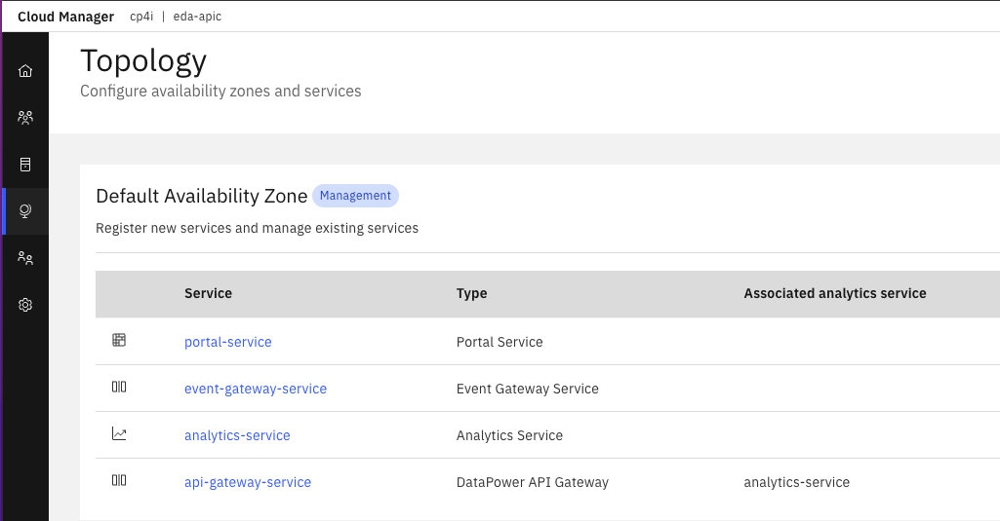

# Note on API Connect

## Documentations

* [Cloud Pak foundational service rroduct documentation](https://www.ibm.com/docs/en/cpfs?topic=operator-administration-panel)
* [CP4I - Manage API product documentation](https://www.ibm.com/docs/en/cloud-paks/cp-integration/2021.4?topic=managing-your-apis)
* [EDA article on API as a pattern](https://ibm-cloud-architecture.github.io/refarch-eda/patterns/api-mgt/)
* [Dev practice for API](https://developer.ibm.com/devpractices/api/)
* [See older Product tutorials](https://developer.ibm.com/components/api-connect/tutorials/)

## There are four different Components in API Connect v10.x

* **Management System** (API Manager) provides two functional roles: the API Manager and the Cloud Manager.
It contains a persistent database that is used to store the configuration data about the system.
It provides a rich set of RESTFul and CLI commands to automate API Management tasks for your organization. It maintains and manages the connection to the user registries that validate both providers and consumers of APIs.
* **Gateway Service**: is the runtime component for the API, enforcing the security constraints, rate limits, invoking backend services, ... 
* **Analytics Service**: built on-top of Elastic Stack, store event logs, visualization and aggregation on metric data.
* **Developer Portal Service**: expose API to developers.



The above screen shot is coming from the Cloud Admin console > Topology, and  represents the registered services for the minimum configuration

###  Cloud Manager 

API Cloud Manager controls the infrastructure of the API Cloud.

### API Manager 

API manager controls the creation, publication, and management of APIs

## Concepts to keep in mind

* API Connect users belong to organizations
* A provider organization (often shortened as p-org) is a group of people who create, publish, and maintain APIs that are then used by people in a consumer organization.
* You publish APIs by adding them to a Product and then publishing the Product to a Catalog. To be able to publish Products to a Catalog, the Catalog must be assigned at least one gateway service so that the APIs in the Product are available to be called at a gateway service endpoint.
* A catalog is a staging target that behaves as a logical partition of the gateway and the developer portal. Typically, an API provider organization uses a development catalog for testing APIs under development and a production catalog for hosting APIs that are ready for full use.
* A Space provides a level of isolation within a Catalog. In API Connect this capability is often referred to as syndication to describe the management and control of APIs that can be given to individuals, groups

### Catalog


* a Catalog has a one to one relationship with a Portal Site
* Catalogs provide isolated API run-time environments within a pOrg
* Catalogs can impact API consumption, and also impact logical partitioning on the API Gateway

Within a Catalog there is the following functionality:

* Configure Gateway Services for the Catalog
* Configuring the Developer Portal Service for API consumers
* Managing API Consumer organizations
* API lifecycle management and approvals (API stage versus API publishing)
* API consumer (Application developer) on-boarding and user registries
* API endpoints - The URL for API calls and the Developer Portal are specific to a particular Catalog
* TLS Client Profiles to be used in the Catalog
* OAuth providers to secure access to APIs in the Catalog
* User defined policies - Each Catalog can also have user defined policies to extend the out
of the box policies available to build APIs

## High availability

[See this whitepaper](https://community.ibm.com/HigherLogic/System/DownloadDocumentFile.ashx?DocumentFileKey=21e9c4e0-f733-c7b1-3267-b1a604ebb0e1&forceDialog=0)

## Demo

The following are high level steps to get started on a new API C installation

### Cloud Manager

* Verify cluster is installed

```sh
oc get apic
```

* URL: <cloud-admin-ui> endpoint that is entered during installation, followed by /admin

```sh
# Get url
oc get routes | grep mgmt-admin 
# add /admin
chrome http://eda-apic-mgmt-admin-cp4i.itzroks-270002161e-w57vvf-6ccd7f378ae819553d37d5f2ee142bd6-0000.sjc04.containers.appdomain.cloud/admin
# Use common service indentification to reach the Cloud Manager UI
```

[See accessing cloud manager user inteface in non CP4I installation](https://www.ibm.com/docs/en/api-connect/10.0.x?topic=environment-accessing-cloud-manager-user-interface). The secret and admin user is defined in LUR, but not used in the context of CP4I, as IAM  is used in this case. 

* [Configure email server](https://www.ibm.com/docs/en/api-connect/10.0.x?topic=settings-configuring-email-server-notifications) to be able to send notifications to invited user. (mailserver.hursley.ibm.com on port 25)
* [Select it as notification server](https://www.ibm.com/docs/en/api-connect/10.0.x?topic=settings-configuring-email-server-notifications).
* Create a provider organization from the Cloud Admin console. Select the Common Services User Registry
* Add users to the Common Services User Registry, use an existing email address of a user defined in tha IAM. One Automation Developer, 

### Develop APIs and products

* Go to the API management console https://....containers.appdomain.cloud/integration/apis/cp4i/eda-apic/manager/
* Select the organization in which you want to define catalog and api product
* Define a catalog
* Go to your service (quarkus app) download the openapi doc (/q/openapi), add .yaml extension to the openapi file, and upload it


The product 'orderlifecycleapis:1.0.0 (OrderLifeCycleAPIs)' cannot be staged because the API 'orderentitylifecycle:1.0.0 (Order entity life cycle)' is not enforced but has x-ibm-configuration.gateway value set to 'event-gateway' (it has to be absent or empty).