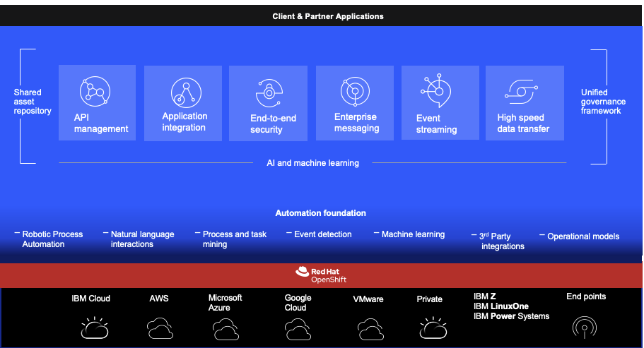
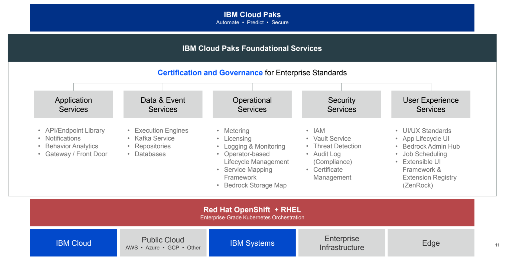

# Cloud Pak for Integration

!!! info
    Updated 4/29/2022

## Addressing integration challenges

* 70% of digital transformation projects fail due to lack of integratio quality (2019).
* Manual tasks requiring expert integration skills -> cp4i will bring automate integrations powered by AI
* Lack of operational visibility to improve integrations -> improve quality with continuous feedback based on real-world data
* Only one integration style -> Use varied integration methods and styles to you advantages
* Drive new engagement models and digital transformation

    * Manage APIs, define new channels
    * respond to events in real-time for engaging experiences
    * Access and move data in fast, secure way

* Accelerate integration while reducing costs

    * AI powered integration: recommend integration patterns, flow mapping, and config changes
    * Reuse integration: decompose larger integration into independant integrations. Integration asset repository.
    * Simplify operation: easy to build with CI/CD workflows. Easy to deploy to same platform, no more central ESB

* Reduce exposure to business and security risks

    * Secure access to critical assets
    * Protect transactional integrity
    * Balance workloads

The CP4I view is for the developer to use the right tool for the right problem.

## CP4I

All components of CP4I can be combined in any way as required and are deployed 100% as containers. Each capability is deployed and managed by a corresponding operator.

CP4I also provides an optional Platform Navigator, an over-arching Management UI layer that provides a common UI experience for various installed integration capabilities. Platform Navigator is not required to deploy individual CP4I capabilities, as each integration capability can be deployed independently leveraging its cloud native deployment operators.

Currently, foundational services mostly are focused on identity and access management for Platform Navigator UI, single sign-on experience for UI, license metering

## 2021.4 release

* [Event Endpoint Management](/eepm) to support buying at the API calls per month level to access kafka events or at the resource usage level.
* AI-driven API Test generation is designed to automate the process of generating these API test cases. 
Watson Insights for suggested tests are generated through analysing production OpenTracing data. 
This helps to determine distinct behaviours in an API implementation
* Support OpenShift on IBM z Integrated Facility for Linux, and on IBM Power Systems

## Foundational services (bedrock) overview

* layer between OCP and the cloud pak
* Origanized into 5 distinct pillars

  * application services
  * data & event services
  * operational services
  * security services
  * user experience services

* Want to be able to start small.
* Certification for k8s process in place and key for foundational services layer
* pluggability: taking advantage of existing vendor's public cloud.
* Based on operators

## Demo videos

* Natural Language Integration - Describe desired integration flow simply using natural language. [Demo video](https://www.youtube.com/watch?v=-LfDIt4e6XM)
* Transformation Generator - Define the format of source and target data, and automatically generate the complex mapping transformation. [Demo](https://www.youtube.com/watch?v=hylRwfRQZX8)
* AI for API Testing - Automatically observe API traffic in a prod environment, identify where it lacks test coverage, and build tests with no human input. [Demo](http://ibm.biz/intro-aitestgen)
* Mapping Assist - Intelligent automation that maps a source to target using semantic understanding. [Demo](https://www.youtube.com/watch?v=hCHBfBbIAZQ)
* Cloud Native HA for MQ - Automatically replicates message data between MQ cloud instances, maintaining continual availability of the messaging service- all without the cost and complexity of shared external storage. [Demo](https://www.youtube.com/watch?v=a68Xog-0rig)

## Messaging positioning

* 75% of companies will have adopted cloud techno and hybrid multi-cloud. 
* digital interactions with end-users have increased since the beginning of covid. 
* **Messaging connects those digital endpoints and their data in the most flexible, highly available, and scalable way**

Messaging spans three pillars: 

1. **Business Critical Communication**: Application and systems across enterprises, within their data centers or clouds need to be able to communicate reliably, securely and simply. Technologies such as Hypertext Transfer Protocol (HTTP) and REST APIs provide communication of data between applications, however they often lack the consistent quality of service required for business critical communications such as exactly once or guaranteed delivery. With Business Critical Communications, two applications are communicating with one sending a request message, directed towards the other application, to complete a specific function. The source application is knowledgeable that the other application exists and that it can complete this particular function. This could be part of an overall chained business process so we sometimes refer to this as **conversational messaging**
1. **Event Driven Enterprise**: In the case of Event Driven Enterprises, events are emitted from applications to an event stream, the source application has no knowledge of who or what is listening to the events being emitted, or even if anyone is. The source application is normally completely disconnected from the target application. In addition, the event stream stores all emitted events, and this stream history is available to consuming applications, in the cases of failure.
1. **High Speed Transfer**: Sometimes it may be necessary to move data over long distances or poor networks – and distance typically degrades conditions on all networks – while data is in transit, it’s important for it to be secure…. between on-premises and hybrid cloud environments regardless of size, distance, or network conditions.

### Why MQ

Secure 
## Installation Steps Overview

There are different sources for installing Cloud Pak for integration.

* [Product documentation](https://www.ibm.com/docs/en/cloud-paks/cp-integration/2021.4?topic=installing)
* [Installation guide web app](https://www.ibm.com/docs/guide/viewer/public/cloud-paks/cp-integration/2021.4)
* [Joel Gomez's Tinkering CP4I site](https://github.ibm.com/joel-gomez/tinkering-cp4i/)
* [The EDA gitops catalog](https://github.com/ibm-cloud-architecture/eda-gitops-catalog) for operators, and operand definitions. The readme for this project is kept up to date.
* [Real-time inventory gitops](https://github.com/ibm-cloud-architecture/eda-rt-inventory-gitops)
* [KC Solution gitOps](https://github.com/ibm-cloud-architecture/kc-solution-gitops)

### Decide if the operators are installed at namespace scope or at cluster level. 

  With namespace scope, each project effectively behaves as a different tenant. There can be one Platform Navigator installed in each namespace, and that Platform Navigator owns only the instances in that namespace. A single instance of IBM Cloud Pak foundational services is installed in the `ibm-common-services` namespace.

  Here are the operators to be installed:

  * **IBM Cloud Pak for Integration**: Top level Cloud Pak for Integration operator that install all other Cloud Pak for Integration operators automatically
  * **IBM Cloud Pak for Integration Platform Navigator**: Provides a dashboard and central services
  * **IBM Automation foundation assets**: Stores, manages, retrieves and searches for integration assets
  * **IBM Cloud Pak for Integration Operations Dashboard** tracing across instances to allow troubleshooting
  * Then any product specific operator.

### Prepare the OpenShift
   
1. Prepare a suitable Red Hat OpenShift cluster with suitable storage.

    [IBM Cloud storage supports](https://www.ibm.com/docs/en/cloud-paks/cp-integration/2021.4?topic=requirements-supported-options-cloud)

1. Make the operators available to the cluster. 

    IBM Operator Catalog provides certified operators for IBM products that can be deployed using the Red Hat OpenShift Operator Hub.

1. Install the operators using the Operator Hub and Operator Lifecycle Manager.
1. Deploy capabilities and runtimes using the operators.

    `Operators > OperatorHub > Integration & Delivery > IBM Cloud Pak for Integration operator`.

### Considerations

  The first four steps are done by cluster administrator, while developer or solution administrator deploys operator runtimes and define operands.

  If the operators are installed at namespace scope, each namespace effectively behaves as a different tenant.

  All IBM Cloud Paks installed in a cluster must be installed in the same mode, we cannot mix cross namespaces or within a namespace.

When Cloud Pak for Integration is installed in the **All namespaces** (the operator is installed in `openshift-operators`), 
there can be only **one Platform Navigator** per cluster, and all Cloud Pak instances are owned by that Platform Navigator.

A single instance of IBM Cloud Pak foundational services is installed in the `ibm-common-services` namespace if the foundational services
 operator is not already installed on the cluster.

Operators need a small set of cluster level permissions to allow manipulation of resources defined at cluster scope, such as reading Custom Resource Definitions.

???- "Other resources"
    * [Product documentation](https://www.ibm.com/docs/en/cloud-paks/1.0?topic=installing-installation-options)
    * [Red Hat marketplace for CP4I](https://marketplace.redhat.com/en-us/products/ibm-cloud-pak-for-integration)
