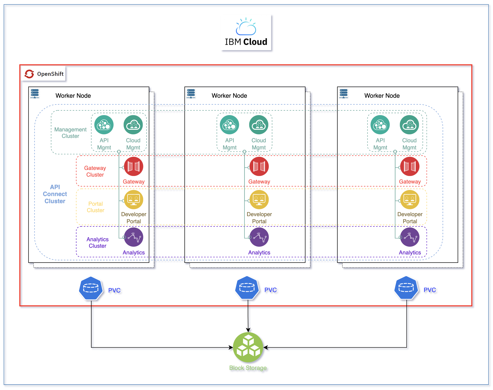

# Event end point management


## Event Endpoint Management deployment

### CP4I Installation

* [Product documentation - installation](https://www.ibm.com/docs/en/SSGT7J_21.4/install/install.html)
* IBM recommends installing the operators for Platform Navigator, Automation Foundation assets, and Operations Dashboard because they assist in the deployment and management of the other capabilities.
* Typically, a cluster administrator installs the operators, and an automation administrator creates the custom resources
* Select installation mode for the operators: **All namespace** (in the `openshift-operators`) or specific namespace: operator only processes resources created in that namespace
* If the operators are installed at cluster scope, the entire cluster effectively behaves as one large tenant.
* If the operators are installed at namespace scope, each namespace effectively behaves as a different tenant.
* With **All namespace** there can be only one Platform Navigator installed per cluster, and all Cloud Pak instances are owned by that Platform Navigator.
* Verify the cluster scope permission needed per capabilities in [this product doc](https://www.ibm.com/docs/en/cloud-paks/cp-integration/2021.4?topic=reference-cluster-scoped-permissions)
* For both installation modes, by default a single instance of IBM Cloud Pak foundational services is installed in the `ibm-common-services` namespace if the foundational services operator is not already installed on the cluster.

### EEPM deployment

* [Product documentation - deployment](https://www.ibm.com/docs/en/cloud-paks/cp-integration/2021.4?topic=capabilities-event-endpoint-management-deployment)
* Install an instance of the Event Endpoint Management capability in a single namespace.
* Event Endpoint Management is installed and configured by the API Connect operator through the EventEndpointManager custom resource type
* There are different deployment profiles: minimum with one node, and then 3 nodes 
* Use yaml from one of the solution, be sure to include the namespace for the target project where EEPM will run.

```sh
oc apply -k 
```

* Verify

```
oc get eventendpointmanager eda-eepm -ojsonpath={.status.phase}
```

    The installation creates the following pods
    
| pods | description |
| ---  |  --- |
| postgres-operator| a dedicated operator to manage local postgresql servers |
| postgreql server | |
| backrest repo | an postgresql server for REST  repository |
| pgbouncer | |
| LDAP | | 
| nats operator | NATS middleware operator| 
| nat cluster | NATS servers |
| nats  cluster | NATS servers |

...wait some time...

## Getting Started

An IBM API Connect cluster (defined through its APIConnectCluster Custom Resource Definition - CRD), deploys the following subsystems:

* Management Cluster (ManagementCluster CRD)
* Portal Cluster (PortalCluster CRD)
* Gateway Cluster (GatewayCluster CRD)
* Analytics Cluster (AnalyticsCluster CRD)



???- tip "Info"
    The reason for the IBM API Connect subsystems to be called clusters is because each of those can be easily deployed highly available by using the profile property. As a result, it is common to see and strongly recommended, specially on production environments, to deploy all of these IBM API Connect subsystems using their highly available profile, which will deploy 3 replicas of each.

* [Key initial configuration tasks that you must complete in the Cloud Manager user interface after installing and deploying IBM® API Connect](https://www.ibm.com/docs/en/api-connect/10.0.x?topic=environment-cloud-manager-configuration-checklist)

???- "More Reading"
    * [AsyncAPI - summary](https://ibm-cloud-architecture.github.io/refarch-eda/patterns/api-mgt/#support-for-async-api)
    * [](https://developer.ibm.com/patterns/share-event-based-apis-with-event-endpoint-management/?mhsrc=ibmsearch_a&mhq=event%20endpoint)