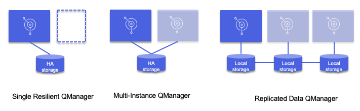
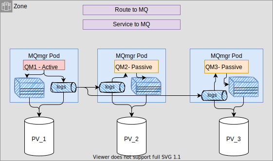
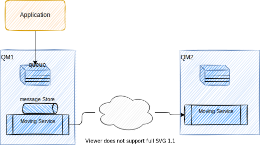

# IBM MQ compendium

IBM MQ is the enterprise solution to exchange message over queues.

As it supports loosely coupling communication between applications, via asynchronous protocol, and message exchange, it has to be part of any modern digital, responsive solutions, and so it makes sense to write about it in the context of EDA.

It is used for years to support asynchronous communication in mainframe applications. 

## Overview

* [My own MQ summary in the EDA reference architecture site](https://ibm-cloud-architecture.github.io/refarch-eda/technology/mq/) to get summary of the main concepts, the benefits in an EDA, and installation with Cloud Pak for Integration.

A queue manager can be thought of in two parts: the data stored on disk, and the running processes that allow access to the data. 

Queue managers can be connected together via network channels to allow messages to flow between disparate systems and applications on different platforms including on-premise and cloud systems

### MQ value propositions

* No data loss, no duplicate
* Integrate with transaction
* Scale horizontally: add more queue managers to share tasks and distribute the messages across them. 
MQ Clusters will even intelligently route messages to where they’re needed. 
The world is full of horizontally scaled MQ systems that handle billions of messages a day.
* High availability with replicated Queue managers. Active/active horizontal scaling for always on systems
* Lightweight and scale to run in any size
* Containerized, runs in orchestration like OpenShift

### Comparing MQ Pub/Sub and Kafka

Assess the following characteristics:

* **Event History**: does the solution need to be able to retrieve historical events either during normal and/or failure situations? If so for how long and how much data?
* **Fined Grained Subscriptions:** Should applications receive all event types from a topic? (Even events that are irrelevant to them ) With MQ topics, they are hierarchical, so it is possible for consumer apps to subscribe to different level of the topic. With Kafka topics 
are partitioned and consumers get all the events from one to many partition.
* **Scalable Consumption:** if 100 consumers subscribe to all events on a topic, IBM MQ will create 100 messages for each published event (with the exception of multicast Pub/Sub). Each of event will be stored and, 
if required, persisted to disk using system resources.
* **Transactional Behavior:** With pub/sub thee tx requirement is less critical, than in queues

## High Availability

[High availability for IBM MQ in containers](https://www.ibm.com/docs/en/ibm-mq/9.3?topic=containers-high-availability-mq-in) proposes 3 HA configurations.

{ width="1000" }

See [my summary here](https://ibm-cloud-architecture.github.io/refarch-eda/technology/mq/#high-availability)

* **Native HA** queue managers involve an active and two replica Kubernetes Pods, which run as part of a Kubernetes StatefulSet with exactly three replicas each with their own set of Kubernetes Persistent Volumes. It only runs in the same k8s cluster.

{ width="1000" }


Any queue manager can be moved to a different Kubernetes Node, as long as it keeps the same data (provided by Kubernetes Persistent Volumes) and is still addressable across the network by client applications.

If the PVs are served via a SAN then there will be replications done at the SAN level too.

* **Multi instance** active - standby topology with PV RWM settings.
### Clustering and distributed queuing

Distributed queuing means sending messages from one queue manager to another. Clustering QM simplifies the communication configuration between QMs.

{ width="1000" }

Each queue manager has a definition for each of its queues (local or remote).

If the messages are destined for a remote queue, the local queue manager holds them on a transmission queue, which persists them in a message store, until they can be forwarded to the remote queue manager.

Each queue manager contains communications software, known as the moving service, that the queue manager uses to communicate with other queue managers.

A channel is a one-way communication link between two queue managers.

The software that handles the sending and receiving of messages is called the Message Channel Agent (MCA). There is a message channel agent (MCA) at each end of a channel.

### Replicated Data Queue Managers

MQ Advanced supports synchronous replication and fast quorum based take over for HA scenarios, recovery in seconds. 
It also supports asynchronous replication between quorum groups to support long distance DR deployments.

All nodes support concurrently running multiple different active queue managers with bidirectional asynchronous replication,
supporting active/active HA and DR topologies.

Use queue manager leader and two replicas. So messages are replicated in three locations. 
Those are exact replicas, maintaining configuration, message order, transactional state.
Quorum ensures consistency and rapid failure (within a second) and recovery.

The  MQ operator helps to deploy MQ manager with declarative manifest, with native HA, cross availability zones,
with all the networking services, and storage needed. Applications connected to MQ manager do not know
how many queue managers are behind their request.

### Always on MQ

MQ provides a [uniform cluster](https://www.ibm.com/docs/en/ibm-mq/9.1?topic=clusters-uniform) consisting of multiple active queue managers acting as a single messaging service.

Each Queue manager has the same resource, queues, channels...

Applications can connect to any of the queue managers within the uniform cluster. This removes any dependency on a specific queue manager, resulting in better availability and workload balancing of messaging traffic. 

The queue managers  are configured almost identically, so that an application can interact with them as a single group.
### Insight to your data

**Stream MQ** data by adding a new queue and specify the original queue the  name of the streaming queue

## MQSC commands 

Use [MQSC commands](https://www.ibm.com/docs/en/ibm-mq/9.0?topic=reference-mqsc) to manage queue manager objects, including the queue manager itself, queues, process definitions, channels, client connection channels, listeners, services, namelists, clusters, and authentication information objects.

* Example of common commands: (start a bash in the docker image and use `runmqsc` tool)

```sh
display queue(rawtx)
```

Those MQSC commands can be define in a config map to be loaded inside the docker image. See example of such [map here]()

```yaml
apiVersion: v1
kind: ConfigMap
metadata:
  name: mq-mqsc-config
data:
  example.mqsc: |
    DEFINE QLOCAL('ITEMS') REPLACE
    DEFINE CHANNEL('DEV.ADMIN.SVRCONN') CHLTYPE(SVRCONN) REPLACE
    DEFINE QLOCAL('DEV.DEAD.LETTER.QUEUE') REPLACE
    ALTER QMGR DEADQ('DEV.DEAD.LETTER.QUEUE')
    DEFINE CHANNEL(DEV.APP.SVRCONN) CHLTYPE(SVRCONN) 
    ALTER QMGR CHLAUTH (DISABLED)
    REFRESH SECURITY TYPE(CONNAUTH)
```
## AMQP

[Advanced Message Queuing Protocol](https://www.amqp.org/) is a standard to integrate with messaging product. IBM MQ supports [AMQP 1.0](https://www.ibm.com/docs/en/ibm-mq/9.3?topic=applications-developing-amqp-client).

* MQ supports AMQP communication on port 5672, and defining a AMQP Channel. 
* The [Apache Qpid JMS](https://qpid.apache.org/components/jms/index.html) library uses the AMQP 1.0 protocol to provide an implementation of the JMS 2 specification.
* AMQP channel are managed in the same way as other MQ channels
* Using IBM MQ, Apache Qpid JMS applications can do publish/subscribe messaging and point-to-point messaging


* Good article ["Developing JMS apps with Quarkus and GraalVM"](https://developer.ibm.com/tutorials/mq-running-ibm-mq-apps-on-quarkus-and-graalvm-using-qpid-amqp-jms-classes/). it includes how to build a custom MQ docker image.
* [Building an image with custom MQSC and INI files, using the Red Hat OpenShift CLI](https://www.ibm.com/docs/en/ibm-mq/9.2?topic=dcqmumo-building-image-custom-mqsc-ini-files-using-red-hat-openshift-cli)

### Build custom MQ docker image

Here are the step to build a custom image for MQ

* Clone [https://github.com/ibm-messaging/mq-container.git](https://github.com/ibm-messaging/mq-container.git)
* Select the branch for the version of MQ to be used: `git checkout 9.2.5`  or `git checkout master`
* For production image download last MQ release tar file from ibm support or ppa (Select something like `IBM MQ 9.3 Long Term Support Release for Containers for Linux on x86 64-bit Multilingual`), then copy the `tar.gz` file  to `mq-container/downloads` folder
* For developer image no need to download it, go to developerwork site to get the image
* Edit the `install-mq.sh` file and change the following variable to use AMQP channel

    ```sh
    export genmqpkg_incamqp=1
    ```

* Set up AMQP authority, channel, and service properties by adding the contents of the [add-dev.mqsc.tpl](https://github.com/ibm-messaging/mq-dev-patterns/blob/master/amqp-qpid/add-dev.mqsc.tpl) file 
to the bottom of the `/incubating/mqadvanced-server-dev/10-dev.mqsc.tpl` file in your cloned repository

* Start the build

  ```sh
  export MQ_ARCHIVE_DEV=IBM_MQ_9.3_LIN_X86-64_NOINST.tar.gz 
  export MQ_VERSION=9.3 
  export LTS=true 
  export DOCKER_BUILDKIT=0 
  export REGISTRY_USER=jbcodeforce  
  export REGISTRY_PASS='quotethepasswordandescape$with\$'
  # Development image
  make build-devserver
  # Production image
  make build-advancedserver
  ```

> If you get this error: `Error response from daemon: network with name build already exists` do

```sh
docker stop build-server 
docker network rm build
```

> Error ` This is due that docker build does not support `--network` anymore.

## Configuring the Queue Manager

It is recommended that you configure MQ in your own custom image by  adding your own MQSC file into the `/etc/mqm` directory on the image. This file will be run when your queue manager is created. See [this tech note](https://github.com/ibm-messaging/mq-container/blob/master/docs/usage.md#customizing-the-queue-manager-configuration).

Another way is to use `mqsc` inside of the running container:

```sh
docker exec -ti ibmmq bash
dspmq
```

## Compendium

* [Release 9.3](https://www.ibm.com/docs/en/ibm-mq/9.3)
* [Developer IBM articles - query](https://developer.ibm.com/?q=MQ)
* [Getting started with MQ](https://developer.ibm.com/gettingstarted/ibm-mq/)
* [Run IBM® MQ in a container](https://github.com/ibm-messaging/mq-container) with relevant [developer article.](https://developer.ibm.com/tutorials/mq-connect-app-queue-manager-containers/) and [Usage of the docker](https://github.com/ibm-messaging/mq-container/blob/master/docs/usage.md) image.
* [MQ download](http://ibm.biz/mq-downloads) 
* [MQ fundamentals](https://developer.ibm.com/articles/mq-fundamentals/): nice set of diagrams and explanation of queues, MQ managers...

With links to supporting programming languages.
* [MQ Cheat sheet](https://developer.ibm.com/messaging/learn-mq/mq-tutorials/dev-cheat-sheet/)
* [High availability](https://pages.github.ibm.com/cloudpakbringup/mq-deployment-guide/high-availability/intro/)
* [IBM MQ samples and patterns](https://github.com/ibm-messaging/mq-dev-patterns) best source to get you jump straight in and play
* [AsyncAPI MQ Bindings](https://github.com/asyncapi/bindings/tree/master/ibmmq)
* [Administering a queue manager using IBM MQ Console - IBM Cloud](https://cloud.ibm.com/docs/mqcloud?topic=mqcloud-mqoc_admin_mqweb)
* [First demo on docker](https://developer.ibm.com/tutorials/mq-connect-app-queue-manager-windows/#docker)
* [Develop a JMS point to point application](https://developer.ibm.com/tutorials/mq-develop-mq-jms/) The code of this IBM tutorial is also in this repository under the `democlient/MQJMSClient` folder so we can test the configuration.

## Coding and personal studies

### MQ messaging coding challenge

See [the MQ Challenges in java note](/java/mqChallenge) and the [Java-studies/mqChallenges](https://github.com/jbcodeforce/java-studies/tree/master/mqChallenges).

Some comments:

* When a publisher publishes a message to a topic string, one or more subscribers for that topic string receives the  message
* A JMS application can use the JMS destination object which maps to a topic in the same way as it would use 
the destination to map to a queue, in a point to point scenario. For the publication to reach the subscriber 
successfully, both the publisher and the subscriber must match same topic string. The subscriber will get 
publications only from the time they subscribe to a topic.
* If a publication is sent before the subscription by a specific application is created, that application will not get it.
* Request response or request reply is an integration or messaging pattern where the application that sends a message to another application, requires a reply of some sort from the receiving application.
* This is often based on the point to point messaging style and can be synchronous (the sending application waits for the response before it times out) and asynchronous (also called request/callback, where the sending application disconnects but sets up a callback to handle a reply).
* The sending application usually sets a reply-to-destination and a correlation-id so that a response can get back to the right sender application.
* For the event booking service the reply-to destination has been defined administratively on the queue manager. However, the requester could dynamically create a temporary destination from its JMS session to complete the exchange.

JMS topic subscription code is in [TicketSubscriber.java]()

### Code repositories

* [refarch-eda-store-simulator](https://github.com/ibm-cloud-architecture/refarch-eda-store-simulator) a quarkus app with JMS producer to MQ 
* [The Real time inventory gitops](https://github.com/ibm-cloud-architecture/eda-rt-inventory-gitops) includes MQ broker deployment descriptor, kafka connect definitions...
* [eda-lab-mq-to-kafka](https://github.com/ibm-cloud-architecture/eda-lab-mq-to-kafka): A hands-on lab series to demonstrate end-to-end integration between a JMS application using JMS to MQ and then Kafka Connect and Kafka topics, sending sold item data from different stores to MQ and Kafka using an MQ Kafka connectors.
* [refarch-container-inventory](https://github.com/ibm-cloud-architecture/refarch-container-inventory) older JEE app still need work
* [refarch-mq-messaging](https://github.com/ibm-cloud-architecture/refarch-mq-messaging), need a deep refresh.
* [mqChallenges in Java Studies repo](https://github.com/jbcodeforce/java-studies) with the challenge code and other quarkus - mq one.
* [AMQP for life insurance demo - simulator](https://github.com/jbcodeforce/life-insurance-demo)
* [Saga with MQ - gitops](https://github.com/ibm-cloud-architecture/https://github.com/ibm-cloud-architecture/eda-kc-gitops)

    * [eda-kc-order-cmd-mq](https://github.com/ibm-cloud-architecture/eda-kc-order-cmd-mq)
    * [eda-kc-reefer-kn-mq](https://github.com/ibm-cloud-architecture/eda-kc-reefer-kn-mq)
    * [eda-kc-voyage-ms-mq](https://github.com/ibm-cloud-architecture/eda-kc-voyage-ms-mq)
