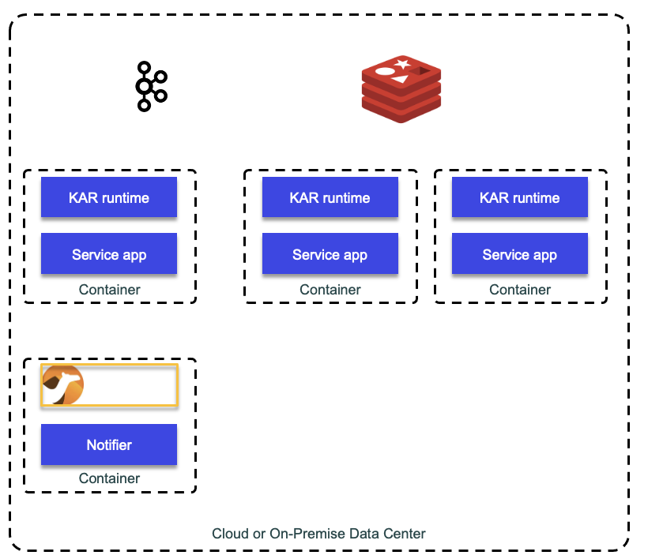

# KAR

[KAR](https://github.com/IBM/kar) is an IBM research initiative to implement the actor model for cloud native stateless or stateful microservices.

KAR is deployed as a side car to the microservice to expose a REST api so the service can make synch or asynch calls to other microservices,
produce ot consume events or manage its persistence state.



Together the KAR processes form a mesh, which uses kafka for decoupling and reliable req/rep interactions. mesh has no leader, no single point of failure, and no external dependency other than a Kafka and Redis instances

## Some concepts

* KAR makes it easy to structure the state of microservices as a collection of actor instances
* Each actor instance is responsible for its own state. 
* The state of an actor instance can be saved or restored safely (into Redis)
* Actors are relocatable
* A KAR application is composed of one or more application components. Individual components may be deployed as simple OS processes running directly on a development machine or as containers running inside one or more Kubernetes or OpenShift clusters. 
* A KAR application consists of a dynamic set of components, event sources and sinks, and a persistent store.
* An application component is a unit of compute and state.  It is joined to a specific application at launch time 
* To address scalability, KAR handles dynamic scaling of replicated stateless and stateful microservices. It leverages K8S scheduler for stateless applications and itw own mechanism for stateful
* Stateful components intended to be scalable or fault-tolerant should either manage their state on their own or leverage KAR's actors and persistent store
* Server component handle HTTP requests issued by the KAR runtime and emit HTTP request to the runtime too.
* Leverage Apache Camel for integrating with external source and sink.
* An application component may offer a single service identified by its name,


### DDD and Actors

The actor model fits well on supporting reactive system implementation as they are message driven, resilient, and elastic. 
The architecture is simplified to two layers: the communication (web controller) and the domain model.
Actors can be seen as Object (of OOD) done right.

Bounded contexts are also reactives, reacting to asynch web request or messages and producing events and messages. Actors are within the bounded context. 
Persistence is separated from command to query.

Stateful logic in the domain layer maps nicely into Actors. Actors run in different processing and can be remote to the existing
controller. 
Router actors can handle the logistics of sending messages to other actors that may be distributed across 
the cluster. A router actor receives messages, but it does not handle the message itself. 
It forwards the message to a worker actor.


Schema registry is used to define structure for inter bounded context communication. 


### Akka

Akka is the well established, scala based, actor model framework. It helps to develop distributed application. 
KAR is a polyglot actor model, and application components communicate over Kafka and persist state in Redis. 
KAR runtime process runs alongside each application component. It offers APIs to facilitate the implementation of actors

### Vert.x

Polyglot event driven, non-blocking programming library. See [study here](../java/vertx.md). The event bus is an internal protocol, but could use Kafka too.

## Getting started

See [Getting started](https://github.com/IBM/kar/blob/main/docs/getting-started.md), source code is under ~/Tools/kar-1.xx.

Kar uses Redis and Kafka so docker-compose will start both.

```sh
RESTART_POLICY=always ./scripts/docker-compose-start.sh
# Set environment variable for Redis and Kafka
source ./scripts/kar-env-local.sh
```

Then code, once packaged, is executed via the `kar` cli. 

## KContainer revisited

See [this repository]().
