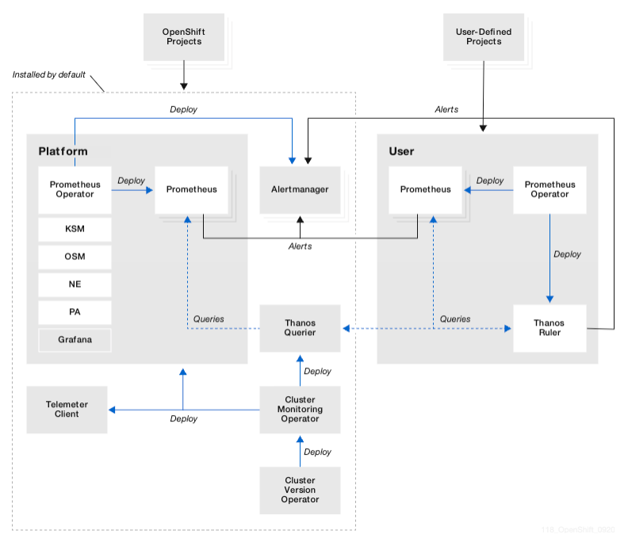

# Prometheus

[Prometheus](https://prometheus.io/) is an open source project, originally built at SoundCloud, used to monitor apps. It is part of CNSF since 2016.

Prometheus collects and stores its metrics as time series data, i.e. metrics information is stored with the timestamp at which it was recorded, alongside optional key-value pairs called labels.

Time series collection happens via a pull model over HTTP.

The figure from prometheus site shows the components of a prometheus deployment:

Prometheus scrapes metrics from instrumented jobs, either directly or via an intermediary push gateway for short-lived jobs. It stores all scraped samples locally and runs rules over this data to either aggregate and record new time series from existing data or generate alerts.

Prometheus configuration is YAML. See example of [monitoring the real-time inventory here.]()

## OpenShift context

* With Red Hat OpenShift Container Platform, you can monitor the OpenShift platform.
* The monitoring stack for the platform is based on Prometheus and Grafana.
* During Day 1 operation you may want to keep time series data in a persistence volume, and configure the alert manager to forward to the good destination

| Component | |
| --- | --- |
| Prometheus	| Used to provide a time-series data store for metrics, rule evaluation engine and alert generation.|
| AlertManager |	Responsible for alerts handling and notification to external systems. |
| Thanos	| Responsible for metric aggregation across Prometheus instances as well as alert generation engine. |
| Grafana	| Used to provide dashboard and metric visualization capabilities.  This is a read only instance of Grafana to show platform metrics |

* Day 02 operations include verifying platform metrics, performance data, and alerts are reaching the correct destination

* Knowledge base: [IBM Cloud architecture red-hat-openshift-container-platform-day-2-ops](https://www.ibm.com/cloud/architecture/content/course/red-hat-openshift-container-platform-day-2-ops). Some guiding principles for the definition and design of Site Reliability Engineer activities:

    * Immutable / Disposable Infrastructure
    * Infrastructure as Code
    * Automate as much as possible

* During the application design, spend time to define the saturation monitor goals. On Day 2, verify application metrics, monitor app to verify it acts as expected, liveness, health check.