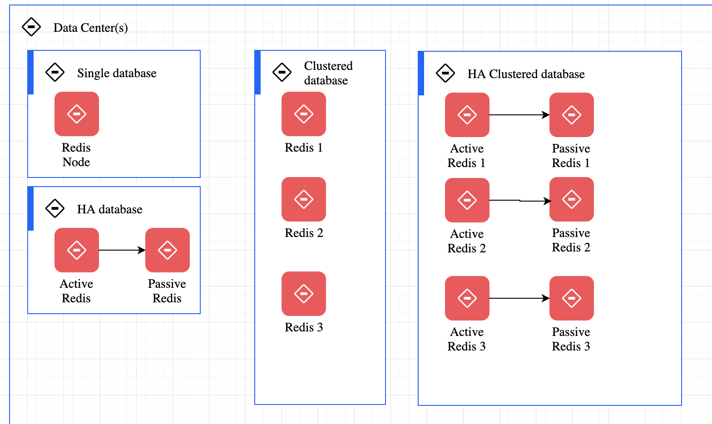

# Redis

[Redis](https://redis.io/) is in-memory data structure store `<key-value>`, used as a database, cache, and message broker. 

Redis provides 

* Support to different data structures such as Strings, hashes, lists, sets, sorted sets, range queries, bitmaps, hyperloglogs, geospatial indexes, and **streams**. 
* built-in replication
* transactions
* different levels of on-disk persistence
* high availability via Redis Sentinel and automatic partitioning with Redis Cluster

## Getting started / concepts

Can be used using docker:

```sh
docker run --ulimit memlock=-1:-1 -it --rm=true --memory-swappiness=0 --name redis_quarkus_test -p 6379:6379 redis:6.2
# Then in the shell use redis-cli
redis-cli 
....:6379> <enter a command>
....:6379> SET counter 100
....:6379> GET counter
....:6379> INCR counter
```

See the [list of commands](https://redis.io/commands)

Redis can be told that a key should only exist for a certain length of time.

```sh
SET alert valueofthealert
# time in ms
expire alert 50 
```

## Run it in cluster

See the docker compose under `studies/redis` folder. See some [details on the Bitnami Redis](https://hub.docker.com/r/bitnami/redis-cluster/) image.

Then connect to an existing node:

```sh
docker exec -ti redis_redis-node-1 bash
```

Or start a new docker on the same network

```sh
docker run -ti --network redis_default docker.io/bitnami/redis-cluster:6.2 bash
# remote connect to one of the node in the cluster
redis-cli -h redis-node-0 -a bitnami 
```

## Redis for distributed database

At any given time, a Redis Enterprise cluster node can include between zero and a few hundred Redis databases



See [some details on Redislab documentation](https://redislabs.com/redis-enterprise/technology/redis-enterprise-cluster-architecture/)

## Redis client

* [Jedis]()
* [Redisson](https://redisson.org/) is the most advanced and easiest Redis Java client.
* [Spring data](https://spring.io/projects/spring-data-redis), looks very similar to JMS Spring template.
* [Quarkus](https://quarkus.io/guides/redis)
* [Flink Redis sink connector]()

## Using redis in quarkus

* Add redis client dependency, which comes with a reactive driver and classical one:

```xml
<dependency>
    <groupId>io.quarkus</groupId>
    <artifactId>quarkus-redis-client</artifactId>
</dependency>
```

* Add connection properties: `quarkus.redis.hosts=redis://localhost:6379`
* Add code with redis client

```java

@Inject
RedisClient redisClient;
//...
void set(String key, Integer value) {
    redisClient.set(Arrays.asList(key, value.toString()));
}

void increment(String key, Integer incrementBy) {
    redisClient.incrby(key, incrementBy.toString());
}

String get(String key) {
    return redisClient.get(key).toString();
}
```

The INCR or incrby operation are safe atomic operations 

With Reactive driver:

```java
@Inject
ReactiveRedisClient reactiveRedisClient;

// retrieve all the values for a given key
Uni<List<String>> keys() {
    return reactiveRedisClient
            .keys("*")
            .map(response -> {
                List<String> result = new ArrayList<>();
                for (Response r : response) {
                    result.add(r.toString());
                }
                return result;
            });
}
```
f you are using the `quarkus-smallrye-health` extension, `quarkus-vertx-redis` will automatically add a readiness 
health check to validate the connection to the Redis server.

## Redis as streaming

Redis Streams are primarily an append only data structure. It includes features a set of blocking operations 
allowing consumers to wait for new data added to a stream by producers.
It used the `Consumer Groups` concept of Kafka, to allow a group of clients to cooperate consuming a different portion of the same stream of messages.

Can do streaming processing on top of this append log. 

Example to add an `event` to a log named `telemetries` with auto generated ID.

```s
XADD telemetries * sensor-id 1234 temperature 19.8 co2 14.1
"1621553018591-0"
```

The ID is `<millisecondsTime>-<sequenceNumber>` coded on 64 bits. Sequence Number is for the timestamp at the ms level. Redis streams support range queries by ID. Because the ID is related to the time the entry is generated, this gives the ability to query for time ranges basically for free.

The streams is able to fan out messages to multiple clients. The operation to read from a stream is XREAD:

```s
# Read from a specific Id or the start of the log
XREAD STREAMS telemetries 0
# Read from current last records to get only new records, with 0 timeout so infinite
XREAD BLOCK 0 STREAMS telemetries $
```

It can be seen as a time series store, and then clients can get records by ranged of time, 

```s
# query from start to end
XRANGE telemetries - +
XRANGE telemetries 1621553351764 +
# only the 2 first records
XRANGE telemetries - + COUNT 2
# return in reverse order
XREVRANGE telemetries + - 
```

or alternatively to iterate the messages using a cursor to incrementally check all the history

### Consumer groups

With XREAD we can consume the same stream from different clients and even to replica to provide more read scalability.
But we can also use consumer group to provide a different subset of messages from the same stream to many clients.

Some characteristics:

* The same message will not be delviered to multiple consumers
* Consumers are uniquely identified, within a consumer group. 
* Each consumer group has the concept of the first ID never consumed.
* Consumer need to acknowledge the read so the message can be evicted from the consumer group
* Consumer group keep track of pending messages (not yet acknowledged)
* A single stream can have multiple consumer groups
* Consumer groups are a server-side load balancing system of messages from a given stream to N different consumers

```sh
# create a consumer group
XGROUP CREATE telemetries mygroup $
# instead of using last message ID $,  If we specify 0 instead the consumer group 
# will consume all the messages in the stream history to start with

# Add consumer reading one message
XREADGROUP GROUP mygroup clientID_1 COUNT 1 STREAMS telemetries
#  Or listening indefinitively
XREADGROUP GROUP mygroup clientID_1 BLOCK 0 STREAMS telemetries
# acknowledge the message as processed, it will no longer be part of the pending messages history
XACK telemetries mygroup 1526569495631-0
```

*Remarks:* all those commands are accessible via the Redis client.

* Consumers are auto-created the first time they are mentioned
* XREADGROUP can read from multiple keys at the same time
* XREADGROUP is a write command as the consumer group is modified as a side effect of reading. 
It can only be called on active node instances.
* When restarted a consumer may see duplicate messages as the acknowledge was not perform while crashing
* In case of consumer that will never restart, it is possible to claim the pending messages of this given
consumer so that such messages will change ownership. Consumer has to inspect the list of pending 
messages, and will have to claim specific messages using a special command, otherwise the server will
 leave the messages pending forever. (`XPENDING` combined with `XCLAIM`)

The processing looks like the Kafka Topic partitions, but here the partitions are logical and the
messages are put in the same Redis Key. The way the different clients are served is based on who 
is ready to process new messages and not from which partition clients are reading.

If we really want to partition messages in the same stream into multiple Redis instances, 
we have to use multiple keys and some sharding system such as Redis Cluster. 

### Kafka or Redis Streams

Both Kafka and Redis streams provide all the features we would expect from a streaming 
solution and can scale as much as is needed.

Kafka will be relevant when we have the following requirements

* Huge amount of data
* Exactly once deliver
* no data loss, Fault tolerant to number of nodes -1
* persist messages for a long time
* doing consume-process-produce loop with **Kafka Streams** constructs
* connect to a lot of soures and sink via the Kafka connector framework
* strongly parallelism execution for consumer
* Kafka cluster to maintain is complex
* Cost more money and infrastructure power
* Schema registry, binary serialization, schema for message
* Secure connection, ACL on topic, multi tenancy

Redis will fit well for

* Speed is very important, with in-memory database
* Accept data loss
* Redis provides high availability through a component known as Sentinel, which is using active/passive mechanism
* The cluster configuration of Redis provides fault tolerance by sharding the data and having a similar internal active-passive node
 configuration. All nodes of the clusters are constantly pinging each other to find issues in the mix and once one is detected, 
 it will reconfigure itself to promote an appropriate passive node.
* Any type of data structure
* support Pub/sub with consumer subscription and a push model
* support Redis streams it acts as Kafka 9offset, consumer group...), can be consumed either in blocking or nonblocking ways, 
and support consumer parallelism. 
* more polyvalent
* Value is structure data, like a Hash